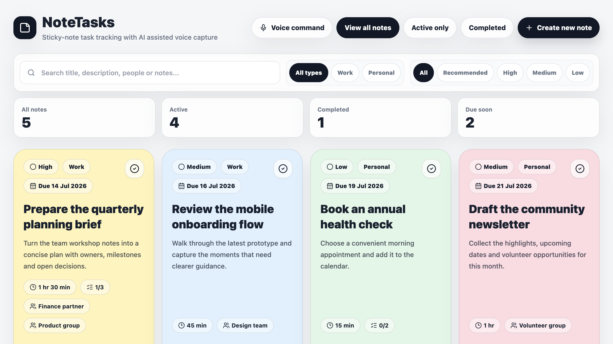

# NoteTasks

Turn scattered thoughts into clear, actionable work—without handing your task history to a hosted
product. NoteTasks is a polished, local-first task board with sticky-note visuals, useful detail views,
optional AI voice commands and an SQLite database that stays on your machine.



## Why NoteTasks?

- **Fast visual planning:** colourful task cards, work/personal views, priorities, deadlines and effort
  estimates make the next action obvious.
- **Enough detail when you need it:** add people or groups, notes, subtasks and a complete activity
  trail without cluttering the main board.
- **Natural voice capture:** optionally transcribe speech locally with Whisper, then use Gemini to
  create, update, complete or remove tasks through a reviewable command preview.
- **Local by default:** tasks live in a private SQLite file. There is no hosted account, analytics
  service or required cloud database.
- **Works across screen sizes:** the responsive interface and PWA manifest make it comfortable on a
  desktop, tablet or phone.

AI is optional. The normal task board works without a Gemini key or Whisper installation.

## Quick start

### Prerequisites

- Node.js 22 or newer and npm
- Python 3.10 or newer for the convenient launcher
- Optional: OpenSSL for local HTTPS and Python packages from `requirements.txt` for voice transcription

### Install

```bash
git clone https://github.com/smib98/Tasks.git
cd Tasks
cp config.ini.example config.ini
npm install
npm run db:push
npm run build
python3 start_notetasks.py
```

Open [http://localhost:3000](http://localhost:3000). A fresh installation starts with an empty board.

For development with hot reload:

```bash
npm run dev
```

## Configuration

`config.ini` is the single local configuration file. It is ignored by Git so API keys, machine paths
and personal settings do not get committed. Start by copying `config.ini.example`.

| Section | Setting | Purpose | Default |
| --- | --- | --- | --- |
| `server` | `host` | Interface to listen on | `127.0.0.1` |
| `server` | `http_port` | Local HTTP port | `3000` |
| `server` | `https_enabled` | Start the optional HTTPS service | `false` |
| `server` | `https_port` | Local HTTPS port | `3443` |
| `database` | `url` | Prisma SQLite connection URL | `file:./notetasks.db` |
| `gemini` | `api_key` | Optional Gemini API key | blank |
| `gemini` | `model` | Gemini model used for command parsing | `gemini-3.5-flash` |
| `whisper` | `python_bin` | Python executable with faster-whisper | `.venv/bin/python` |
| `whisper` | `model` | Whisper model size/name | `base` |
| `whisper` | `device` | Whisper execution device | `auto` |
| `whisper` | `compute_type` | Whisper compute precision | `auto` |

Environment variables such as `GEMINI_API_KEY` and `DATABASE_URL` override matching INI values, which
is useful for containers and service managers.

### Enable Gemini commands

Create a key using the [official Gemini API setup guide](https://ai.google.dev/gemini-api/docs/get-started),
then add it locally:

```ini
[gemini]
api_key = paste-your-key-here
model = gemini-3.5-flash
```

The key is read only by server-side code. Never commit `config.ini` or put the key in browser code.

### Enable local voice transcription

```bash
npm run setup:whisper
```

This creates `.venv` and installs `requirements.txt`. The first transcription may download the chosen
Whisper model. Gemini is still needed to turn a transcript into structured task actions.

Browser microphone access works on `localhost`. For another device on your LAN, enable HTTPS:

1. Set `host = 0.0.0.0` and `https_enabled = true` in `config.ini`.
2. Run `npm run setup:https` to create a machine-specific development certificate.
3. Rebuild with `npm run build`, then run `python3 start_notetasks.py`.

The generated certificate is self-signed and intentionally excluded from Git. Trust it only on devices
you control.

## Optional demo board

The repository contains no personal tasks and seeds nothing by default. To try the layout with the five
generic tasks used in the screenshot, run this only against an empty database:

```bash
npm run db:demo
```

The demo script refuses to modify a non-empty database. To return to a blank board, stop the app, remove
your local SQLite file, then run `npm run db:push` again.

## Common commands

| Command | What it does |
| --- | --- |
| `npm run dev` | Starts the development server using `config.ini` |
| `npm run db:push` | Creates or updates the local SQLite schema |
| `npm run build` | Generates Prisma Client and builds the production app |
| `python3 start_notetasks.py` | Starts the production app with safe port checks |
| `npm run db:demo` | Adds generic demo tasks to an empty database |
| `npm run lint` | Runs ESLint |
| `npm run typecheck` | Runs TypeScript checks |
| `npm run test:api` | Exercises the health and task API against a running app |
| `npm run setup:whisper` | Installs optional local transcription support |
| `npm run setup:https` | Generates an ignored local HTTPS certificate |

## How it is built

```text
Browser / PWA
    │
    ▼
Next.js App Router + React UI
    ├── Task, note, subtask and status API routes ──► Prisma ──► local SQLite
    ├── AI command routes ──► Gemini API (optional)
    └── Voice upload route ──► local faster-whisper (optional)
```

Task validation is handled with Zod, all Gemini calls happen on the server, and uploaded audio is deleted
after transcription.

## Data and security

- NoteTasks is a single-user local application and does **not** include authentication.
- It binds to `127.0.0.1` by default. Do not expose it directly to the public internet.
- SQLite databases, API keys, generated certificates, uploads and local virtual environments are ignored
  by Git and Docker contexts.
- Back up your SQLite file before deleting it or applying substantial schema changes.
- See [SECURITY.md](SECURITY.md) for the disclosure and deployment guidance.

## License

[CC0 1.0 Universal](LICENSE)—use it, adapt it and make it yours.
